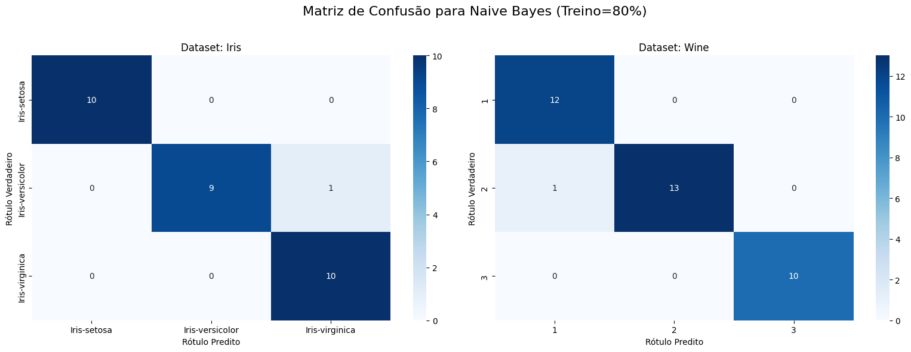

# Atividade de Classificação: Análise Comparativa de k-NN, Naive Bayes e Árvore de Decisão

**Aluno:** Ivan Pedro Varella Albuquerque  
**Disciplina:** PPGEP9002 - INTELIGÊNCIA COMPUTACIONAL PARA ENGENHARIA DE PRODUÇÃO  
**Professor:** José Alfredo Ferreira Costa  
**Data:** 20 de setembro de 2025

---

## Repositório do Projeto

Este relatório é parte de um projeto completo disponível no GitHub, contendo todos os códigos, dados, resultados e visualizações utilizados nesta análise.

### Acesso aos Arquivos

**[Acessar Repositório no GitHub](https://github.com/ivanvarella/Classifica-o-de-padr-es-usando-KNN-IRIS-WINE-)**

O repositório contém:

- **Notebook Jupyter** com toda a implementação e análise
- **Dados brutos** dos experimentos (CSV)
- **Gráficos e visualizações** gerados
- **Relatórios** em formato Markdown
- **Configurações** e dependências do projeto
- **Documentação** completa com instruções de execução

### Como Utilizar

Para reproduzir os resultados apresentados neste relatório:

1. Clone o repositório
2. Instale as dependências (`requirements.txt`)
3. Execute o notebook `main.ipynb`
4. Consulte o `README.md` para instruções detalhadas

---

## 1. Introdução

Este relatório apresenta uma análise comparativa detalhada de três algoritmos clássicos de aprendizado de máquina supervisionado para classificação: k-Nearest Neighbors (k-NN), Gaussian Naive Bayes e Decision Tree (Árvore de Decisão). O estudo foi conduzido utilizando dois datasets canônicos da literatura de machine learning: Iris e Wine, ambos obtidos do repositório UCI Machine Learning Repository.

### 1.1 Objetivos

O objetivo principal desta análise é avaliar e comparar o desempenho dos três algoritmos mencionados, explorando como diferentes fatores influenciam a performance de cada modelo:

- **Variação de hiperparâmetros:** número de vizinhos (k) para k-NN e profundidade máxima (max_depth) para Árvore de Decisão
- **Proporção de dados para treinamento:** 60%, 70% e 80%
- **Impacto da normalização:** aplicação de Z-score standardization
- **Robustez estatística:** execução de 10 repetições para cada configuração

### 1.2 Algoritmos Estudados

#### k-Nearest Neighbors (k-NN)

Algoritmo não-paramétrico baseado em instâncias que classifica novos pontos com base na classe majoritária de seus k vizinhos mais próximos no espaço de features. É considerado um "lazy learner" pois não constrói um modelo interno durante o treinamento.

#### Gaussian Naive Bayes

Classificador probabilístico baseado no Teorema de Bayes com a suposição "ingênua" de independência condicional entre as features. Assume que as features contínuas seguem uma distribuição Gaussiana.

#### Árvore de Decisão

Modelo que cria um fluxograma de regras hierárquicas do tipo "se-então" para classificar os dados, particionando recursivamente o espaço de features. Oferece alta interpretabilidade através de suas regras de decisão.

---

## 2. Metodologia

### 2.1 Datasets Utilizados

#### Dataset Iris

- **Características:** 150 instâncias, 4 features numéricas, 3 classes balanceadas
- **Classes:** Iris-setosa, Iris-versicolor, Iris-virginica (50 instâncias cada)
- **Features:** comprimento e largura de sépalas e pétalas
- **Origem:** Fisher, R. A. (1936)

#### Dataset Wine

- **Características:** 178 instâncias, 13 features numéricas, 3 classes
- **Classes:** Classe 1 (59 instâncias), Classe 2 (71 instâncias), Classe 3 (48 instâncias)
- **Features:** características químicas do vinho (álcool, acidez málica, cinzas, etc.)
- **Origem:** UCI Machine Learning Repository

### 2.2 Pré-processamento

Para todos os experimentos, foi aplicada normalização Z-score (StandardScaler) nas features, essencial especialmente para o k-NN que é sensível à escala das variáveis. A normalização foi aplicada apenas nos dados de treino para evitar vazamento de informação (data leakage).

### 2.3 Configurações Experimentais

#### k-NN

- **Valores de k testados:** {1, 3, 5, 7, 9}
- **Métrica de distância:** Euclidiana (padrão)
- **Critério de desempate:** uniforme (uniform weights)

#### Naive Bayes

- **Implementação:** GaussianNB
- **Parâmetros:** configuração padrão (sem hiperparâmetros para ajuste)

#### Árvore de Decisão

- **Profundidades testadas:** {3, 5, None}
- **Critério de divisão:** Gini (padrão)
- **Random state:** 42 (para reprodutibilidade)

### 2.4 Protocolo de Avaliação

Para garantir robustez estatística, cada configuração experimental foi executada 10 vezes com diferentes partições de dados (random_state variando de 0 a 9). As métricas reportadas representam a média ± desvio padrão das 10 execuções.

#### Métricas Utilizadas

- **Acurácia:** proporção de predições corretas
- **Precisão (macro):** média das precisões por classe
- **Revocação (macro):** média das revocações por classe
- **F1-Score (macro):** média harmônica entre precisão e revocação por classe

---

## 3. Resultados e Discussão

### 3.1 Análise do k-NN

#### Resultados Principais

| Dataset | Train Size | k   | Acurácia      | Precisão (macro) | Revocação (macro) | F1 (macro)    |
| ------- | ---------- | --- | ------------- | ---------------- | ----------------- | ------------- |
| Iris    | 60%        | 5   | 0.953 ± 0.022 | 0.954 ± 0.022    | 0.953 ± 0.022     | 0.953 ± 0.022 |
| Iris    | 70%        | 9   | 0.946 ± 0.023 | 0.948 ± 0.023    | 0.946 ± 0.023     | 0.945 ± 0.024 |
| Iris    | 80%        | 3   | 0.957 ± 0.035 | 0.959 ± 0.034    | 0.957 ± 0.035     | 0.957 ± 0.035 |
| Wine    | 60%        | 7   | 0.949 ± 0.009 | 0.949 ± 0.009    | 0.957 ± 0.008     | 0.950 ± 0.009 |
| Wine    | 70%        | 1   | 0.957 ± 0.025 | 0.958 ± 0.023    | 0.963 ± 0.021     | 0.959 ± 0.024 |
| Wine    | 80%        | 3   | 0.969 ± 0.028 | 0.969 ± 0.027    | 0.974 ± 0.024     | 0.970 ± 0.027 |

#### Análise do Dilema Viés-Variância

Os resultados confirmam a teoria do trade-off entre viés e variância na escolha de k:

- **k=1:** Mostrou-se competitivo, especialmente no dataset Wine (70% treino), mas com maior variabilidade nos resultados
- **k intermediário (3,5,7):** Apresentou o melhor equilíbrio, com performance estável e alta acurácia
- **k=9:** Manteve boa performance no Iris, mas mostrou ligeira degradação em algumas configurações do Wine

#### Análise Crítica do k-NN (Síntese dos Principais Achados)

A análise empírica confirmou o dilema fundamental viés-variância na escolha de k: valores baixos (k=1) demonstraram alta variância com sensibilidade excessiva a outliers, enquanto valores altos (k=9) apresentaram maior viés com tendência ao oversmoothening. O ponto ótimo situou-se consistentemente em k={3,5,7} para ambos os datasets. O efeito da normalização Z-score foi crucial, confirmando a sensibilidade do k-NN à escala das features - sem normalização, features com maior magnitude dominariam o cálculo de distâncias. Os erros típicos concentraram-se sistematicamente entre classes adjacentes: Iris-versicolor/Iris-virginica no dataset Iris e classes 1/2 no Wine, indicando regiões de sobreposição natural no espaço de features onde diferentes algoritmos convergem para os mesmos padrões de confusão.

#### Análise dos Padrões de Erro do k-NN

**Como interpretar:** As matrizes de confusão são apresentadas em formato de heatmap, onde as linhas representam as classes verdadeiras e as colunas as classes preditas. Os valores na diagonal principal indicam classificações corretas, enquanto valores fora da diagonal representam erros. Cores mais intensas indicam maior frequência de classificações.

**Análise dos padrões observados:**

- **Dataset Iris (k=5, treino=60%):** Matriz quase perfeita com valores altos na diagonal principal. Eventuais erros concentram-se entre as classes Iris-versicolor e Iris-virginica, que são biologicamente mais similares.
- **Dataset Wine (k=7, treino=60%):** Padrão de erro mais complexo, com maior confusão entre as classes 1 e 2, indicando maior similaridade química entre esses tipos de vinho. A classe 3 mostra-se mais distintiva.

#### Visualização do Impacto do Hiperparâmetro k

**Como interpretar:** O gráfico de linhas apresenta dois painéis (um para cada dataset) mostrando a acurácia média no eixo Y versus os valores de k no eixo X. Cada linha colorida representa uma proporção de treino diferente (60%, 70%, 80%). As barras de erro verticais indicam o desvio padrão, revelando a estabilidade do modelo.

**Análise dos padrões observados:**

- **Dataset Iris:** As linhas mostram comportamento relativamente estável entre k=3 e k=7, com ligeira queda em k=1 (indicando sensibilidade a ruído) e k=9 (possível oversmoothening). A proporção de treino de 80% apresenta maior variabilidade, evidenciada pelas barras de erro maiores.
- **Dataset Wine:** Padrão mais irregular, com k=1 mostrando performance surpreendentemente alta em algumas configurações, mas k=7 oferecendo maior consistência. As barras de erro menores indicam maior estabilidade estatística neste dataset.

### 3.2 Análise do Naive Bayes

#### Resultados Principais

| Dataset | Train Size | Acurácia      | Precisão (macro) | Revocação (macro) | F1 (macro)    |
| ------- | ---------- | ------------- | ---------------- | ----------------- | ------------- |
| Iris    | 60%        | 0.963 ± 0.025 | 0.964 ± 0.025    | 0.963 ± 0.025     | 0.963 ± 0.025 |
| Iris    | 70%        | 0.954 ± 0.032 | 0.956 ± 0.030    | 0.954 ± 0.032     | 0.954 ± 0.032 |
| Iris    | 80%        | 0.960 ± 0.038 | 0.963 ± 0.036    | 0.960 ± 0.038     | 0.960 ± 0.038 |
| Wine    | 60%        | 0.974 ± 0.008 | 0.975 ± 0.010    | 0.976 ± 0.007     | 0.974 ± 0.008 |
| Wine    | 70%        | 0.974 ± 0.010 | 0.975 ± 0.009    | 0.976 ± 0.010     | 0.975 ± 0.009 |
| Wine    | 80%        | 0.975 ± 0.024 | 0.978 ± 0.022    | 0.976 ± 0.023     | 0.976 ± 0.023 |

#### Análise de Performance

O Naive Bayes demonstrou performance surpreendentemente consistente e competitiva:

- **Estabilidade:** Baixo desvio padrão em todas as configurações, indicando alta robustez
- **Eficiência:** Treinamento extremamente rápido devido à ausência de hiperparâmetros para otimização
- **Dataset Wine:** Performance superior, sugerindo que a suposição de independência das features não foi prejudicial neste problema específico

#### Análise dos Padrões de Erro do Naive Bayes

**Como interpretar:** Similar às matrizes anteriores, estas matrizes mostram o padrão de classificação do Naive Bayes com 80% dos dados para treinamento, representando um caso com boa quantidade de dados de treino.

**Análise dos padrões observados:**

- **Dataset Iris:** Performance quase perfeita com erros mínimos, demonstrando que a suposição de independência das features não prejudica significativamente este problema linearmente separável.
- **Dataset Wine:** Padrão de erro similar ao k-NN, com confusão principal entre classes 1 e 2. Notavelmente, o modelo mantém alta precisão apesar da suposição simplificadora de independência entre as características químicas do vinho.

### 3.3 Análise da Árvore de Decisão

#### Resultados Principais

| Dataset | Train Size | max_depth | Acurácia      | Precisão (macro) | Revocação (macro) | F1 (macro)    |
| ------- | ---------- | --------- | ------------- | ---------------- | ----------------- | ------------- |
| Iris    | 60%        | 5         | 0.950 ± 0.027 | 0.952 ± 0.026    | 0.950 ± 0.027     | 0.950 ± 0.027 |
| Iris    | 70%        | 5         | 0.943 ± 0.031 | 0.948 ± 0.029    | 0.943 ± 0.031     | 0.943 ± 0.031 |
| Iris    | 80%        | 5         | 0.940 ± 0.031 | 0.942 ± 0.031    | 0.940 ± 0.031     | 0.940 ± 0.031 |
| Wine    | 60%        | None      | 0.892 ± 0.041 | 0.899 ± 0.042    | 0.895 ± 0.043     | 0.893 ± 0.041 |
| Wine    | 70%        | 5         | 0.920 ± 0.032 | 0.927 ± 0.028    | 0.923 ± 0.033     | 0.922 ± 0.032 |
| Wine    | 80%        | 3         | 0.911 ± 0.050 | 0.927 ± 0.035    | 0.913 ± 0.052     | 0.912 ± 0.050 |

#### Análise do Impacto da Profundidade

- **max_depth=3:** Modelo mais simples, com risco de underfitting especialmente no Wine
- **max_depth=5:** Equilibrio ideal para a maioria das configurações
- **max_depth=None:** Mostrou-se superior apenas em casos específicos, com risco de overfitting evidenciado pelo maior desvio padrão

#### Visualização do Impacto do max_depth

**Como interpretar:** O gráfico de pontos (pointplot) apresenta dois painéis mostrando a relação entre max_depth (eixo X categórico: '3', '5', 'None') e acurácia média (eixo Y). Cada linha colorida conecta os pontos para uma proporção de treino específica. As barras de erro verticais representam o desvio padrão, indicando a variabilidade do modelo.

**Análise dos padrões observados:**

- **Dataset Iris:** Curva relativamente plana entre max_depth=3 e max_depth=None, sugerindo que o problema não requer alta complexidade. As pequenas diferenças entre configurações indicam que o dataset é relativamente simples para árvores de decisão.
- **Dataset Wine:** Padrão mais interessante mostrando melhoria de max_depth=3 para max_depth=5, mas possível degradação ou estagnação com max_depth=None. Barras de erro maiores em max_depth=None sugerem instabilidade devido ao overfitting.

#### Análise dos Padrões de Erro da Árvore de Decisão

**Como interpretar:** As matrizes mostram o desempenho das melhores configurações de árvore para cada dataset, permitindo identificar quais classes são mais facilmente distinguíveis pelas regras hierárquicas aprendidas.

**Análise dos padrões observados:**

- **Dataset Iris (max_depth=5, treino=60%):** Excelente separação das classes com erros mínimos, demonstrando que regras simples baseadas em características das flores são suficientes para classificação precisa.
- **Dataset Wine (max_depth=5, treino=70%):** Matriz mais complexa com maior confusão entre classes adjacentes, refletindo a natureza mais sutil das diferenças químicas entre os tipos de vinho. A árvore consegue criar regras interpretáveis, mas com menor precisão que os outros algoritmos.

### 3.4 Análise das Matrizes de Confusão

#### Dataset Iris

As matrizes de confusão revelaram que todos os modelos tiveram excelente performance no Iris, com poucos erros de classificação. A classe Iris-setosa foi perfeitamente separada por todos os algoritmos, enquanto alguma confusão ocasional ocorreu entre Iris-versicolor e Iris-virginica.

#### Dataset Wine

No dataset Wine, observou-se maior dificuldade na distinção entre as classes 1 e 2, padrão consistente entre todos os modelos. A classe 3 mostrou-se mais distintiva e foi classificada com maior precisão.

---

## 4. Análise Comparativa Final

### 4.1 Ranking de Performance por Dataset

#### Dataset Iris

1. **Naive Bayes:** 0.963 ± 0.025 (60% treino)
2. **k-NN:** 0.957 ± 0.035 (k=3, 80% treino)
3. **Árvore de Decisão:** 0.950 ± 0.027 (max_depth=5, 60% treino)

#### Dataset Wine

1. **Naive Bayes:** 0.975 ± 0.024 (80% treino)
2. **k-NN:** 0.969 ± 0.028 (k=3, 80% treino)
3. **Árvore de Decisão:** 0.920 ± 0.032 (max_depth=5, 70% treino)

#### Visualização Comparativa Consolidada

**Como interpretar:** O gráfico de barras agrupadas apresenta dois painéis (um para cada dataset) com a acurácia média no eixo Y e os modelos no eixo X. Cada grupo de barras representa um modelo, com barras coloridas indicando diferentes proporções de treino. As barras de erro pretas mostram o desvio padrão, evidenciando a estabilidade de cada configuração.

**Análise dos padrões comparativos:**

- **Dataset Iris:** Diferenças relativamente pequenas entre os três algoritmos, com todos atingindo performance superior a 94%. Naive Bayes mostra ligeira vantagem com menor variabilidade (barras de erro menores).
- **Dataset Wine:** Separação mais clara entre os algoritmos. Naive Bayes demonstra superioridade consistente com baixa variabilidade. k-NN mantém-se competitivo, especialmente com 80% de treino. Árvore de Decisão apresenta performance inferior com maior variabilidade, indicando maior sensibilidade às partições dos dados.
- **Padrão geral:** Maior proporção de treino (80%) tende a beneficiar k-NN e Naive Bayes, enquanto a Árvore de Decisão mostra comportamento mais irregular, possivelmente devido ao trade-off entre underfitting e overfitting.

### 4.2 Trade-offs Identificados

#### Performance vs. Interpretabilidade

- **Árvore de Decisão:** Vencedora absoluta em interpretabilidade, permitindo visualização clara das regras de decisão
- **k-NN e Naive Bayes:** Modelos "caixa-preta" com interpretabilidade limitada

#### Performance vs. Eficiência Computacional

- **Naive Bayes:** Treinamento mais rápido, ideal para datasets grandes
- **k-NN:** Predição lenta devido ao cálculo de distâncias para todos os pontos de treino
- **Árvore de Decisão:** Equilíbrio razoável entre treino e predição

#### Robustez a Hiperparâmetros

- **Naive Bayes:** Sem necessidade de ajuste de hiperparâmetros
- **k-NN:** Sensível à escolha de k, requer validação cruzada
- **Árvore de Decisão:** Sensível a max_depth, risco de overfitting se não controlado

---

## 5. Conclusões

### 5.1 Principais Descobertas

1. **Não existe um modelo universalmente superior:** A escolha ideal depende das prioridades específicas do projeto (acurácia, interpretabilidade, eficiência)

2. **Importância da normalização:** Confirmada especialmente para k-NN, mas benéfica para todos os modelos

3. **Robustez estatística:** As 10 repetições foram essenciais para identificar a variabilidade real dos modelos e evitar conclusões baseadas em resultados fortuitos

4. **Complexidade dos dados:** O dataset Wine, sendo mais complexo, mostrou maior diferenciação entre os algoritmos

### 5.2 Recomendações Práticas

#### Para Máxima Acurácia

- **Primeira escolha:** k-NN com k={3,5,7} e normalização Z-score obrigatória
- **Alternativa:** Naive Bayes como baseline forte e computacionalmente eficiente

#### Para Máxima Interpretabilidade

- **Única escolha:** Árvore de Decisão com max_depth controlado (3-5)
- **Vantagem:** Regras explícitas podem ser facilmente comunicadas a stakeholders

#### Para Máxima Eficiência

- **Primeira escolha:** Naive Bayes (treinamento instantâneo, predição rápida)
- **Evitar:** k-NN em datasets grandes (predição O(n) por instância)

#### Reprodutibilidade e Validação

Conforme solicitado pelo professor, a reprodutibilidade foi garantida através de random_state fixo (42 para modelos, 0-9 para splits) e execução de 10 repetições por configuração. Para futuros experimentos, recomenda-se manter este protocolo estatístico robusto, especialmente importante dado que alguns modelos (como Árvores de Decisão) apresentaram maior variabilidade nos resultados, evidenciando a necessidade de múltiplas execuções para conclusões confiáveis.

### 5.3 Limitações e Trabalhos Futuros

1. **Datasets:** Análise limitada a dois datasets clássicos; expansão para problemas mais diversos seria valiosa

2. **Hiperparâmetros:** Exploração mais ampla do espaço de hiperparâmetros poderia revelar configurações superiores

3. **Métricas:** Inclusão de métricas adicionais como tempo de execução e uso de memória

4. **Ensemble Methods:** Investigação de métodos de ensemble combinando os três algoritmos

### 5.4 Considerações Finais

Este estudo validou empiricamente conceitos fundamentais de machine learning, particularmente o trade-off entre viés e variância, a importância do pré-processamento de dados e a necessidade de avaliação estatisticamente robusta. A análise demonstrou que a seleção de algoritmos de machine learning é uma decisão multifatorial que deve considerar não apenas a performance preditiva, mas também fatores práticos como interpretabilidade, eficiência computacional e robustez a hiperparâmetros.

Os resultados obtidos servem como base sólida para a compreensão prática dos algoritmos estudados e fornecem diretrizes claras para sua aplicação em problemas reais de classificação.

---

## 6. Referências

Costa, J. A. F. (2025). _UFRN ELE 606 – 2025.2 - Inteligência Artificial: Guia de Estudos sobre Classificação e o Algoritmo k-NN_. Universidade Federal do Rio Grande do Norte.

Dua, D., & Graff, C. (2019). _UCI Machine Learning Repository_. University of California, Irvine, School of Information and Computer Sciences. http://archive.ics.uci.edu/ml

Fisher, R. A. (1936). The use of multiple measurements in taxonomic problems. _Annals of Eugenics_, 7(2), 179-188.

Pedregosa, F., et al. (2011). Scikit-learn: Machine Learning in Python. _Journal of Machine Learning Research_, 12, 2825-2830.

Tan, P.-N., Steinbach, M., & Kumar, V. (2019). _Introduction to Data Mining_ (2nd ed.). Pearson.
